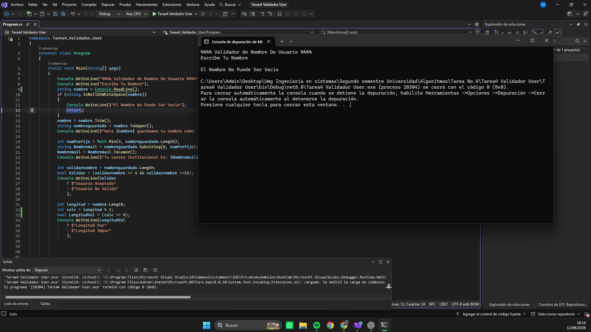
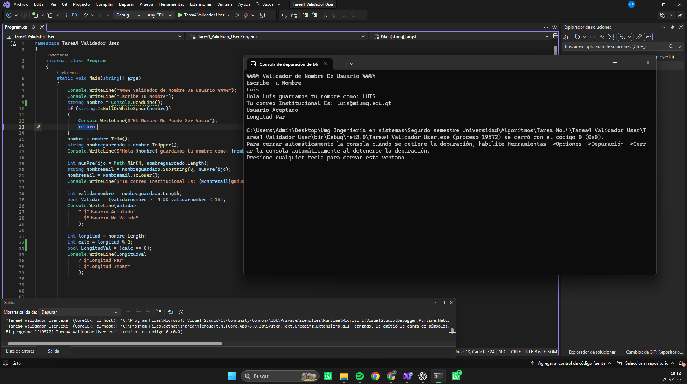
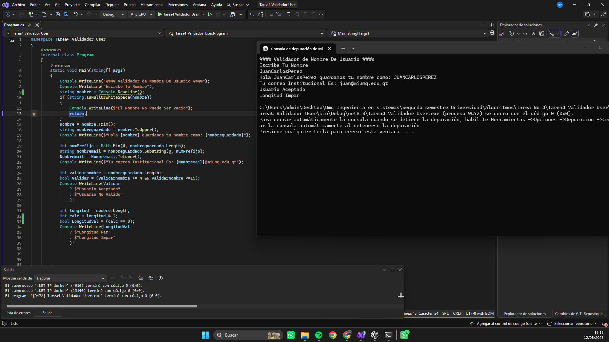
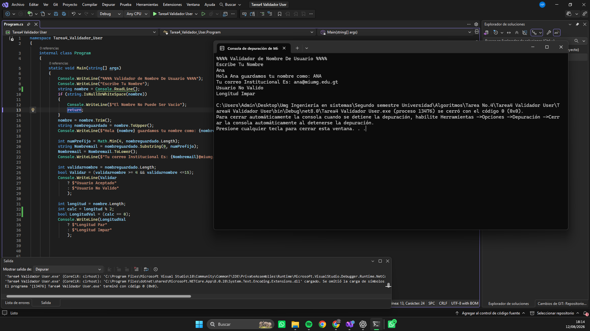
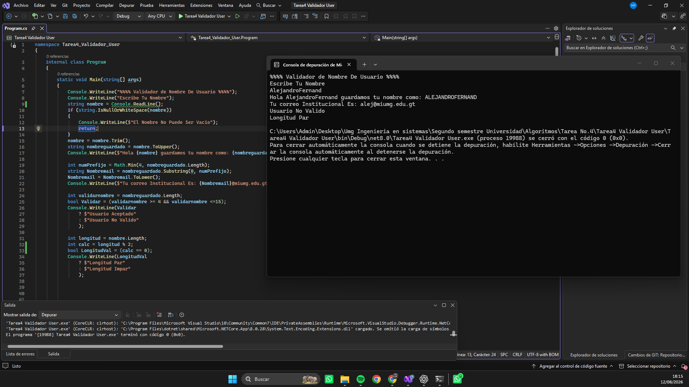

# Tarea 4 Validador De Nombre De Usuario Y Crear Correo Institucional
## Descripción

Programa desarrollado en C# que utiliza:

- Variables int, string y bool
- Impresiones console.WriteLine
- string.IsNullOrWhiteSpace
- if
- .Trim, .ToUpper, .Substring, .ToLower, .Length
- Math.Min
- Expresiones lógicas y Ternarios
- calculo con % 2

## Cómo ejecutar

- Abrir el proyecto en Visual Studio Community.
- Presionar "F5".
- Ingresar un nombre

## Capturas

